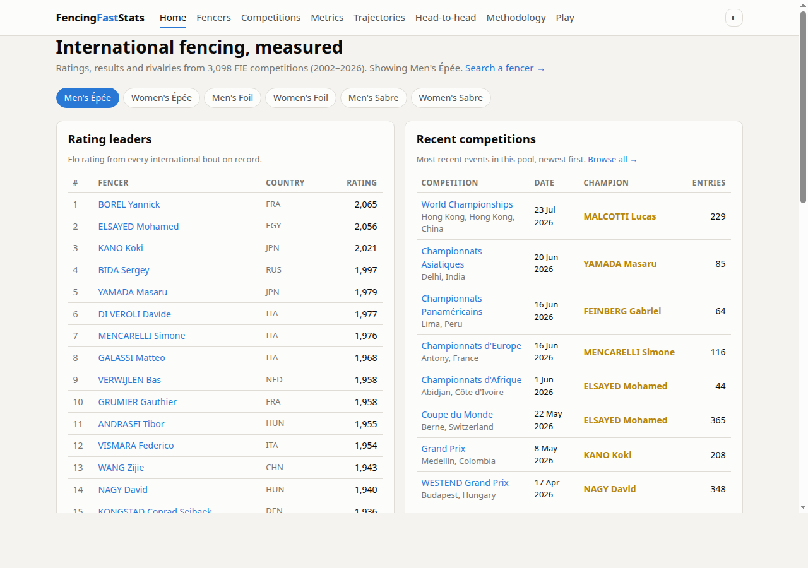
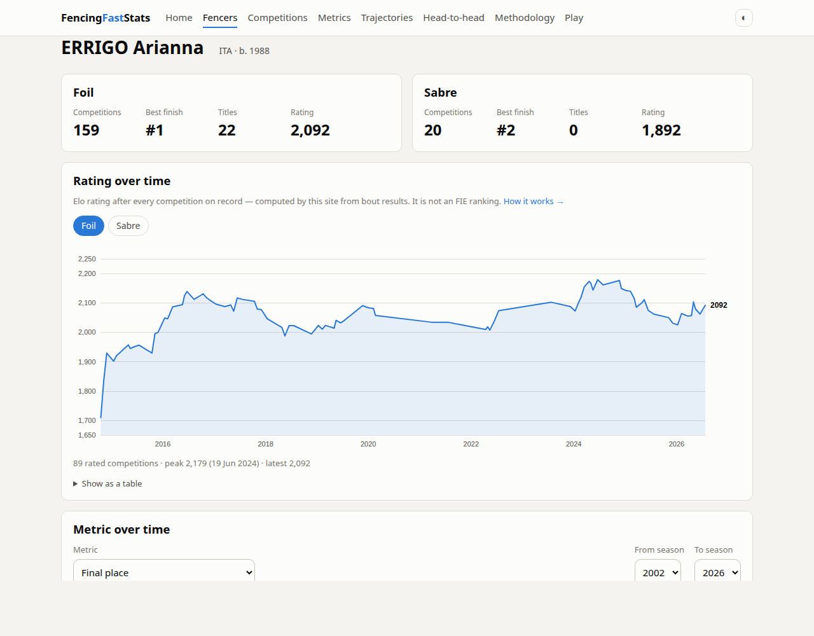
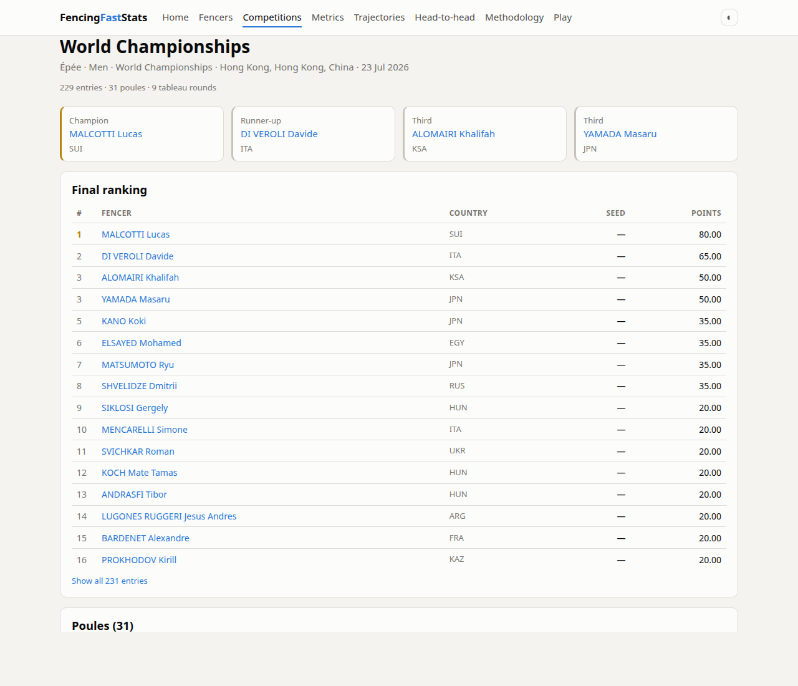
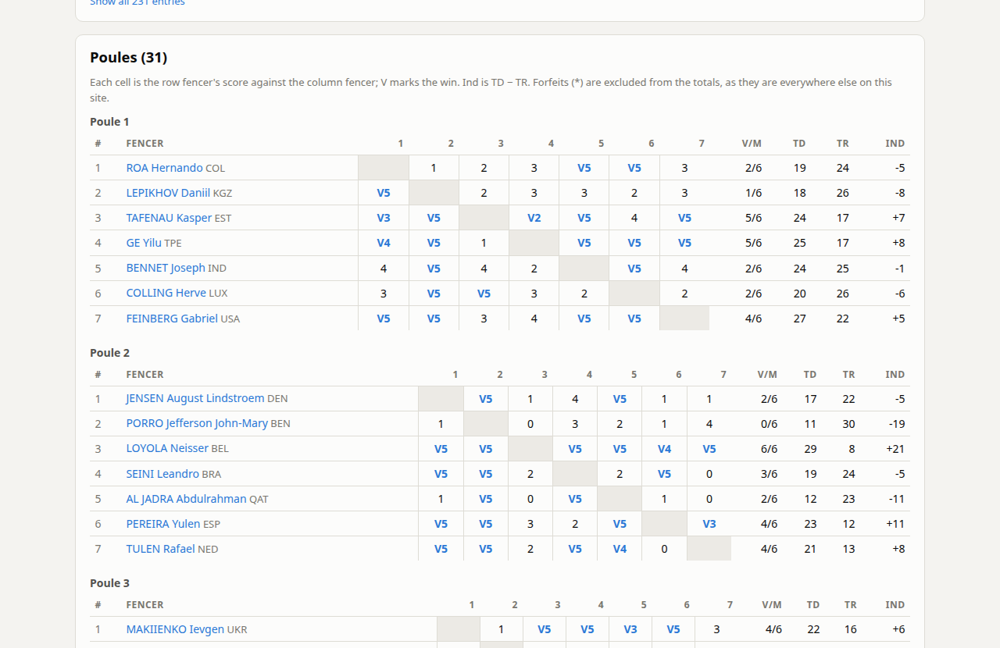
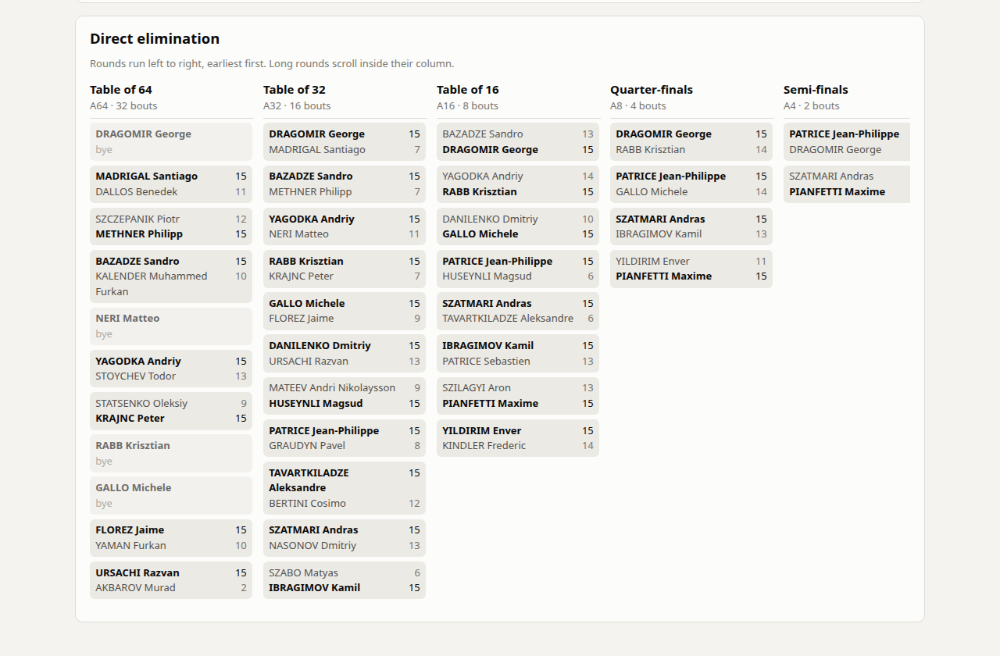
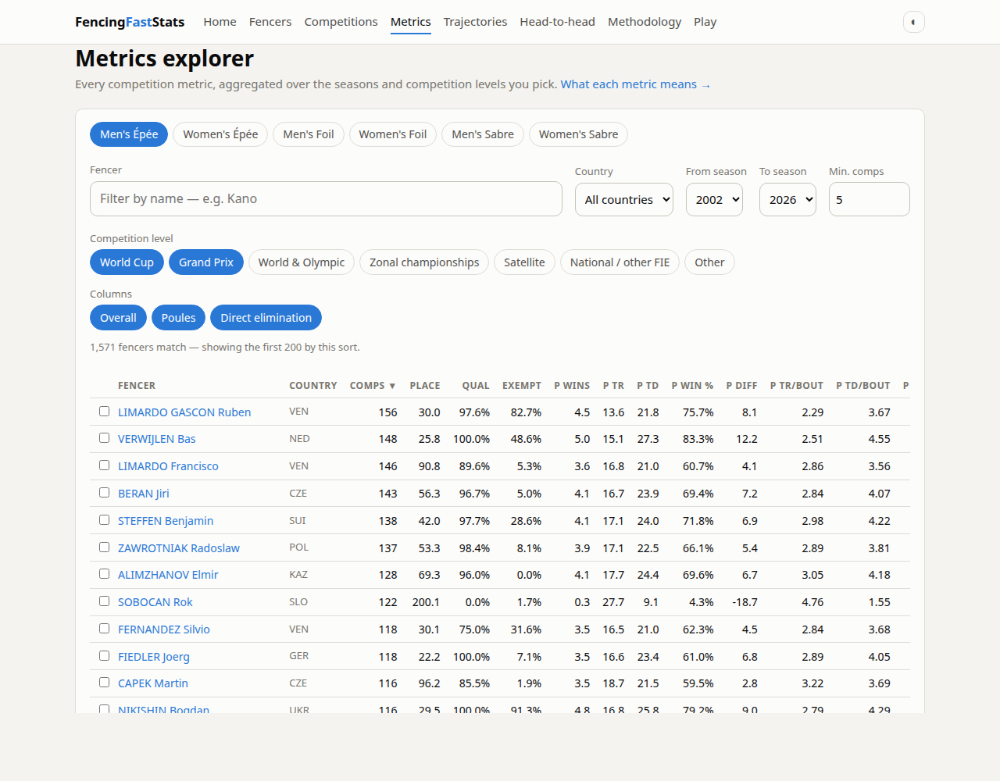
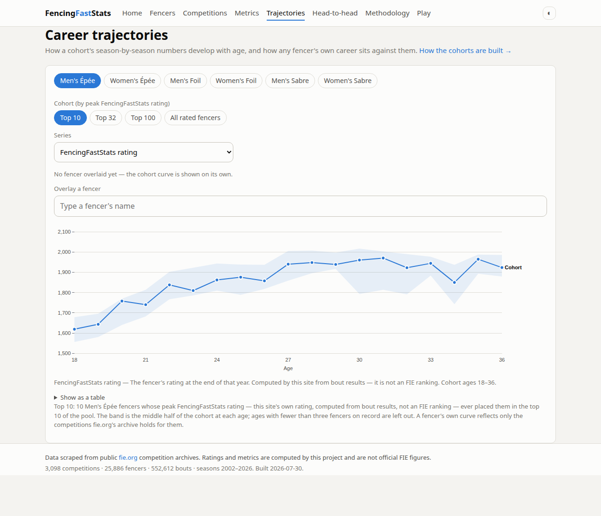
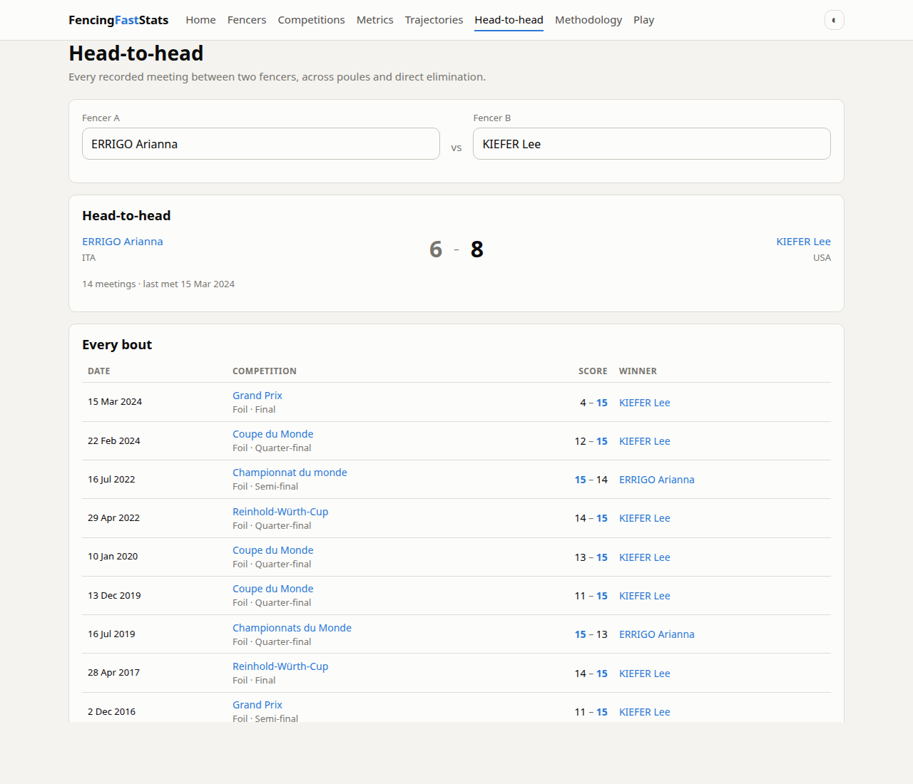

# FencingFastStats — an analytics layer for FIE competition data

**A proposal to the Fédération Internationale d'Escrime**

Prepared by Lucas Stucky · <lbstuckyb@gmail.com> · source: <https://github.com/lbstuckyb/FencingFastStats>

---

## Summary

fie.org publishes the results of every international competition, and nothing that
turns them into knowledge. A poule sheet tells you a fencer went 4/6; nothing on
the site tells you whether that is normal for them, how they compare with the
field, whether they beat this opponent last time, or where their career sits
against everyone else's at the same age.

FencingFastStats is a working answer to that, built from fie.org's own public
archive: **3,098 competitions, 25,886 fencers from 154 countries and 552,612
bouts across seasons 2002–2026**, through the 2026 World Championships in Hong
Kong. It computes 23 per-competition metrics, a rating with full history, and
every head-to-head record in the archive, and serves them as a static website —
no server, no database, hosting cost effectively zero.

It is complete and running today. This document shows what it does, states
plainly where the underlying data runs out, and proposes that the FIE either
adopt it or supply the feed that would make it substantially better.

**What I am asking for:** a conversation, and — if there is interest — access to
an official data feed. Everything else already exists.

## 1. The problem

The FIE holds one of the better datasets in individual sport: every bout of every
international competition, scored touch by touch, with stable athlete identities,
going back decades. Publicly, that dataset is exposed as results pages.

Concretely, a fencer, coach, journalist or fan who visits fie.org today **cannot**
answer any of these:

- How has this fencer's level moved over the last five seasons?
- What is their record against the opponent they meet in the table of 16 — and how
  did those bouts actually go?
- Is a 5/6 poule with a +12 indicator good, at this level, for this weapon?
- Which fencers of this age are on the trajectory of a future top-10 fencer?
- Who starts poules well and who fences into form? Who defends consistently and
  who is erratic?
- Which nations are developing depth, in which weapon, and how fast?

Every one of those is answerable from data the FIE already publishes. None of
them is answered anywhere official. The gap is not data collection; it is the
analytics layer on top.

## 2. The demo

The site is a static web app — plain HTML, CSS and ES modules over pre-baked
JSON. Eleven routes, all deep-linkable.

> **Live demo:** *not yet published.* The GitHub Pages workflow is committed and
> ready (`.github/workflows/pages.yml`); the moment Pages is enabled on the
> repository the site will be live at
> **<https://lbstuckyb.github.io/FencingFastStats/>**. Until then it runs locally
> in two commands (`pip install -e . && ffs build-site`, then
> `python3 -m http.server -d site`), or in a screen share on request.

### Home — rating leaders and the recent calendar, per weapon-and-gender pool



### Fencer profile — a career, including a rating history no other source has



The rating line is this project's own Elo, computed from bout results (§4). Below
the fold: any of the 23 metrics plotted over time, a season-by-season table, the
full result list, and the fencer's most-met rivals.

### Competition — final ranking, every poule grid, and the tableau







### Metrics explorer — the whole field, any season range, any set of levels



Every metric for every fencer in a pool, aggregated over the seasons and
competition levels chosen, sortable on any column. Each metric is averaged over
the competitions that actually carry it, never over competitions entered — the
denominators differ per metric and getting this wrong silently under-reports
(§6).

### Career trajectories — a cohort's path by age, with a fencer laid over it



Median and p25–p75 band for a cohort at each age, so "on track" becomes legible
rather than anecdotal. Cohorts here are defined by peak FencingFastStats rating,
because no historical FIE ranking is publicly retrievable — one of the things an
official feed would fix immediately.

### Head-to-head — the record, and every bout behind it



Also on the site: fencer search over the whole archive, a compare view for up to
six fencers, a methodology page generated from the same metric registry the
pipeline computes from, and a small épée minigame (§7).

## 3. What is in the dataset

| | |
|---|---|
| Competitions | 3,098 (seasons 2002–2026, senior individual) |
| Bouts | 552,612 — 405,320 poule, 147,292 direct elimination |
| Result rows | 260,923 (competition × fencer) |
| Fencers | 25,886, from 154 countries |
| Competition levels | World Cup 827 · Satellite 747 · Grand Prix 492 · Zonal ch. 426 · National/other 390 · World ch. 108 · Other official 72 · Olympic 36 |
| Profiled fencers on the site | 17,148 |
| Head-to-head pairs published | 2,267 (pairs that met ≥5 times, both fencers profiled) |

**The one significant limit, stated up front:** fie.org's public archive carries
**bout-level detail only from 2015 onward**. 1,294 of the 3,098 competitions
(41.8%) have poule and tableau bouts; every season from 2016 on is at or near
100%, and every season through 2013 is at 0% — those competitions exist in the
archive as a final ranking and nothing else. So the metrics, the ratings and the
head-to-head records all effectively begin in 2015, and everything before it is
placings only.

The FIE presumably still holds the pre-2015 bouts. Supplying them would roughly
double the analysable history and give the rating model a run-in of a decade
before the era it currently starts cold in.

## 4. What is computed

All of it from bout-level data; all of it documented in
[`docs/methodology.md`](methodology.md), which is the authoritative spec.

### Per-competition metrics (23)

Defined once in a registry (`src/ffs/metrics.py`) that the pipeline, the site's
column headers and the methodology glossary all read, so a metric cannot be
described differently from how it is computed.

**Overall**

| Code | Name | Definition |
|---|---|---|
| `POS` | Final place | Final placing in the competition. |
| `Q` | Qualified to the tableau | Made it out of the poules into the direct-elimination tableau; averaged, the share of entries where the fencer reached the tableau. |
| `PEXMPT` | Poule exemption | Fenced no poule bouts and went straight into the tableau. |
| `T64+` | Reached the table of 64 | Entries into the table of 64. |
| `TPRE64` | Reached the preliminary table | Entries into the preliminary tableau feeding the table of 64. |

**Poules**

| Code | Name | Definition |
|---|---|---|
| `PVICT` | Poule victories | Bouts won in the poules. |
| `PTR` / `PTD` | Poule touches received / scored | Totals across the fencer's poule bouts. |
| `PIND` | Poule win ratio | Victories divided by poule bouts fenced. |
| `PT-DIFF` | Poule touch differential | `PTD − PTR`. |
| `PMTR` / `PMTD` | Touches received / scored per poule bout | Per-bout means. |
| `PMT-DIFF` | Touch differential per poule bout | `PMTD − PMTR`. |
| `p_tr_std` / `p_td_std` | Spread of touches received / scored | Per-bout standard deviations — how consistent the fencer is bout to bout. |
| `PM1V%` | First poule bout won | How often the fencer starts the poule well. |
| `PM1&2V%` | First two poule bouts won | The same, extended. |

**Direct elimination**

| Code | Name | Definition |
|---|---|---|
| `TMVAVG` | DE victories | Bouts won in the tableau. |
| `TTR` / `TTD` | Touches received / scored per DE bout | Per-bout means. |
| `TMT-DIFF` | Touch differential per DE bout | `TTD − TTR`. |
| `table_tr_std` / `table_td_std` | Spread of DE touches received / scored | Per-bout standard deviations. |

### Rating

Elo per (weapon, gender) pool over every rated bout in the archive: start 1500,
`K = 16` in poules and `K = 32` in direct elimination, doubled for a fencer's
first 30 bouts in that pool. One rating pair (before, after) per fencer per
competition is kept, so every profile carries a full history.

**This is emphatically not an FIE ranking**, and every view that shows it says
so. It is a measure of results-so-far, computed here, from bouts. The sanity
check is that its leaders are the names you would expect — Borel, Kano, Szilágyi,
Kharlan, Volpi, Errigo — without any name-based tuning.

### Head-to-head

Every meeting between every pair of fencers, poule and tableau, with scores,
competition, round and date.

### Validation

The metrics are not asserted, they are checked. The pipeline reproduces a
hand-maintained legacy dataset built from FIE's own historical Excel exports
(2015–2022): **286 of 286 legacy competitions matched, 45,848 matched
fencer-rows, 99.3% agreement** across `POS`, `PVICT`, `PTD`, `PTR`, `PIND`, `Q`
and `TMVAVG`. `POS` agrees at 100.0%.

The residual ~0.7% was traced to genuine holes in fie.org's archive — pools where
individual bouts are simply absent — not to computation. That investigation is
written up in the methodology doc, including two cases where the archive's own
summary fields disagree with its own bout data. A federation-supplied feed would
close these.

## 5. How it is built

```
fie.org (public)  →  scraper  →  canonical parquet  →  stats / Elo / H2H  →  JSON  →  static site
```

- **Scraper** (`src/ffs/fie_client.py`): reads the JSON payload fie.org's own
  pages embed, plus one public REST endpoint the site's own JavaScript uses.
  ≥1.5 s between requests, every response cached to disk so nothing is fetched
  twice. The full 25-season backfill was a one-time run; routine updates fetch
  only new competitions.
- **Canonical tables** (~17 MB of parquet): competitions, athletes, results,
  bouts. Every downstream number is a pure function of these.
- **Site data**: ~213 MB of sharded JSON, regenerated in ~23 minutes and never
  hand-edited. Because it is derived, CI rebuilds it on every deploy; the repo
  stores only the canonical tables.
- **Front end**: vanilla ES modules, a hash router, one vendored charting
  library. No build step, no framework, no server, no database. It is a
  directory of files behind a CDN.
- **Refresh**: one command (`ffs update`) scrapes the competitions that have
  finished since the last run and rebuilds the metrics. Runbook in
  [`docs/updating.md`](updating.md).
- **Tests**: 97 automated tests over the decoder, parser, metrics, discovery and
  CLI, against frozen real payloads.

The relevant point for the FIE is the **cost profile**: static hosting means an
analytics site for the whole archive can be served for a rounding error, and the
pipeline is a scheduled job, not an operations team.

## 6. Correctness commitments

Three principles the site holds to, which matter for anything carrying the FIE's
name:

1. **Nothing computed here is presented as official.** The rating and the cohort
   tiers are labelled as this project's own measure everywhere they appear.
   Official FIE points and rankings are not in the dataset and are never implied.
2. **Every metric is averaged over the population that actually carries it.** A
   fencer with 40 results may have 40 placings but only 12 competitions with
   poule data; averaging over 40 would under-report by a factor of three. Each
   metric names its own denominator in the registry.
3. **Where the archive is thin, the site says so** rather than rendering an empty
   chart — missing poule data, competitions with results only, fencers with no
   record in the selected pool.

## 7. Engagement roadmap

The dataset supports considerably more than tables, and the demo already carries
one small proof that this material can be made playful: `#/play`, a piste-duel
minigame about distance and tempo, tuned so that mashing loses and a competent
policy wins.

Four bigger directions are specified in
[`docs/backlog-phase3.md`](backlog-phase3.md) — what each needs, what it would
take, and what data is missing. In brief:

- **Live win probability.** A bout-state model turning "10–8 in the third" into a
  number, for broadcast overlays and streams. Needs touch-by-touch timing the
  archive does not publish — the single highest-value thing an official feed
  would unlock.
- **Momentum and comebacks.** Run-scoring, comeback frequency, "who wins the last
  three touches" — the language commentary already uses, made measurable.
- **Style profiles.** Clustering fencers on tempo, scoring pattern and
  consistency into recognisable archetypes, so a preview can say what kind of
  fencer someone is meeting.
- **Fantasy and prediction.** A scoring system over competition results, and
  head-to-head pick'em, both of which run on the current schema and are the
  cheapest route to recurring engagement between competitions.

## 8. What an official feed would change

Ranked by how much they matter:

1. **Touch-by-touch bout data with timestamps.** Enables live win probability,
   momentum metrics, and most of the broadcast-facing work. Nothing in the public
   archive substitutes for it.
2. **Pre-2015 bout data.** Doubles the analysable history and gives the ratings a
   proper run-in.
3. **Official ranking points and historical rankings.** Lets cohorts, seedings and
   "expected result" analysis be defined on the federation's own measure instead
   of a proxy.
4. **Athlete biography** (birth date, hand, club, licence status) — currently
   partial. Age-based analysis leans on birth year alone.
5. **Team events and junior/cadet/veteran categories** — out of scope today,
   structurally identical to what already works.
6. **A stable data contract.** The scraper depends on a page format the FIE can
   change at any time without warning. A documented feed serves the FIE as much
   as it serves this project.

## 9. Integration paths

Three options, in ascending order of federation involvement:

**A. Blessing.** The project stays independent, keeps its own domain and branding,
and the FIE simply confirms it is comfortable with the use of public data — and,
ideally, supplies a feed. Zero cost, zero obligation, useful to the sport.

**B. Adoption.** The pipeline and site are transferred to the FIE and run under
fie.org, styled to federation branding, fed directly from the internal database
rather than scraped. The static architecture means hosting it alongside the
existing site is trivial. I would do the integration work.

**C. Partnership.** The FIE supplies data and validation; I continue to build,
with agreed use of federation branding and a shared roadmap toward the broadcast
and engagement features in §7.

Any of the three is an improvement on the current situation, in which the data
exists and the analysis does not.

## 10. Data and legal posture

Stated plainly, because it should be:

- Every input is **public, unauthenticated data** served by fie.org to any
  visitor. No account, no paywall, no protected endpoint, no credential is
  involved.
- **`fie.org/robots.txt` disallows nothing**, and explicitly covers `/api/`.
  Crawling is permitted by the site's own machine-readable policy.
- The scraper is **deliberately gentle**: ≥1.5 s between requests, everything
  cached to disk, no concurrency, no re-fetching. The full historical backfill
  was a single one-time pass; routine updates are a handful of requests per
  competition.
- **Attribution is on every page.** The site's footer credits fie.org as the
  source on all routes.
- **Nothing is passed off as official.** See §6.
- **No personal data beyond what fie.org publishes itself** — name, country,
  birth year, results — is collected, and none of it is re-sold. The site has no
  accounts, no tracking and no advertising.
- **If the FIE would rather this were not scraped, I will stop.** The offer is
  to switch to an official feed, or to shut the pipeline down, on request. That
  commitment is not contingent on the outcome of this proposal.

## 11. What happens next

The site is finished, tested and documented; the code is public. Concretely, I am
asking for:

1. Fifteen minutes to walk through the demo.
2. An indication of whether path A, B or C in §9 is of interest.
3. If any of them are — a conversation about the data feed in §8.

If none of it is of interest, that is a complete answer, and the project
continues as an independent one built on public data, under the posture in §10.

---

*Figures in this document were taken from the dataset on 2026-08-06 and are
reproducible from the committed canonical tables.*
